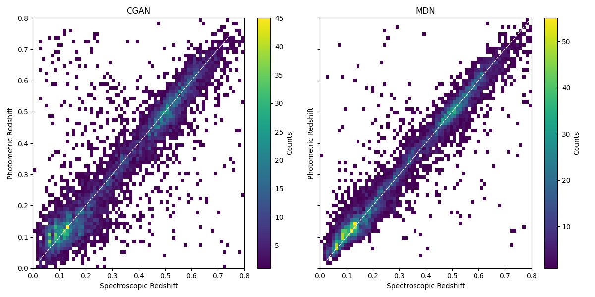

# CGAN-photoz

This repository contains the companion code and data for the paper "Determination of galaxy photometric redshifts using Conditional Generative Adversarial Networks (CGANs)" that is submitted to Astronomy and Computing and can be found at [2501.06532](https://www.arxiv.org/abs/2501.06532).

## Repository Contents

- **CGAN_photoz_KL_divergence.pth**: These are the trained weights of the generator network.
- **MDN_photoz.pth**: These are the trained weights of the Mixture Density Network.
- **stripe82_galaxies.csv**: This file contains the data used for training and testing the algorithm.
- **training_losses.csv**: This file includes the losses and Mean Squared Error (MSE) recorded during the training of the algorithm.
- **photoz_gan_kl_divergence.py**: This is the code for training the CGAN.
- **photoz_mdn.py**: This is the code for training the Mixture Density Network for comparison purposes.

## Metrics

